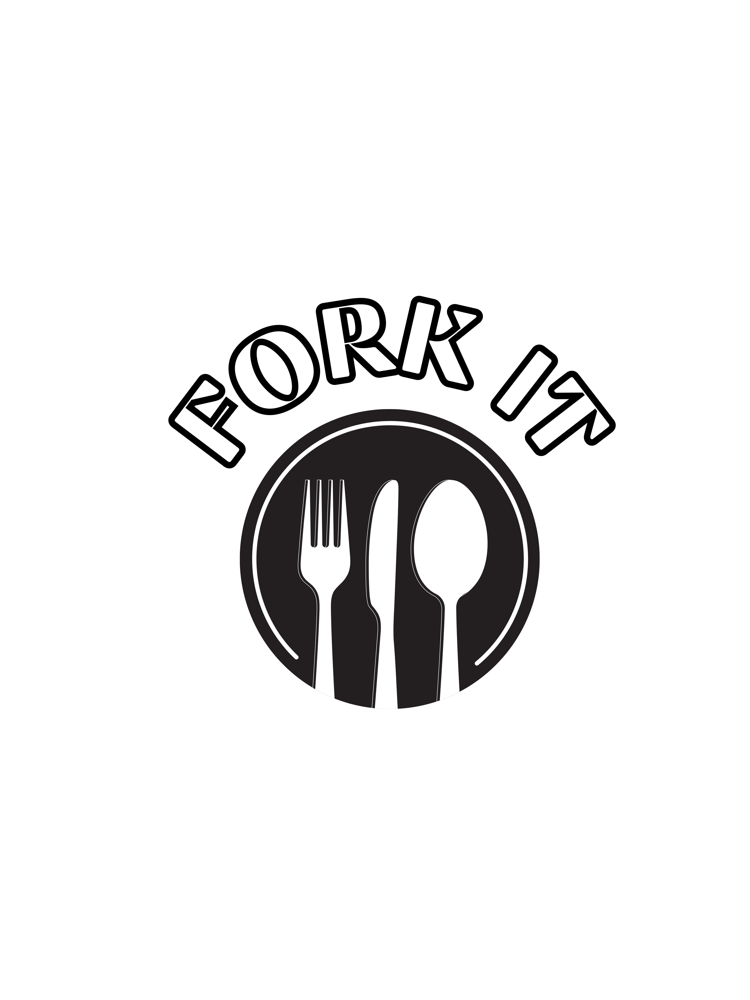

# 🍴 Fork It - Restaurant Rating App

A full-stack app that lets users rate and review restaurants! Users can sign up, log in, browse restaurants, add their own, and leave ratings.

---

## 🌐 Live App

🔗 [Deployed App on Render](https://yourapp.onrender.com)

---

## 📸 Screenshot

---

## 🛠️ Technologies Used

- Node.js
- Express
- MongoDB + Mongoose
- EJS
- CSS Flexbox
- Express-session

---

## 🧠 Planning Docs

- [Trello board](https://your-planning-board-link)
- [Wireframes](https://your-wireframes-link)

---

## 🙏 Attributions

- GIF background by Giphy
- Fonts from Google Fonts
- Restaurant data inspired by Yelp

---

## 📈 Next Steps

- Add favorite restaurants list per user  
- Add Google Maps integration for restaurant locations  
- Allow image uploads with Cloudinary  
- Add pagination or filtering

